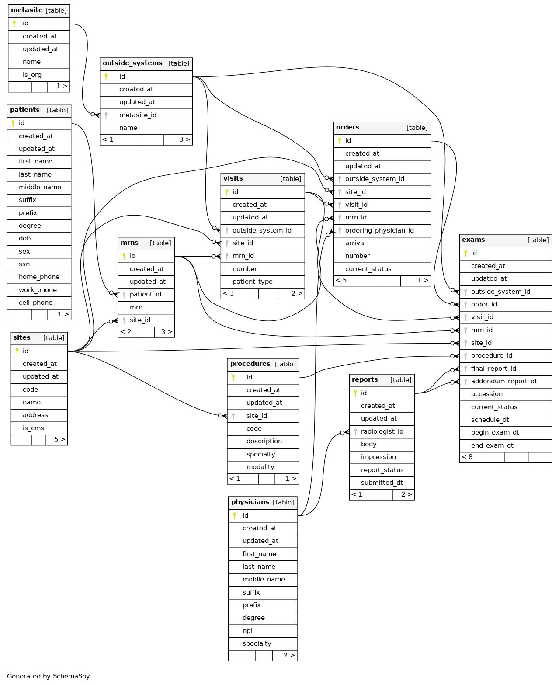

# Changelog

All notable changes to this project will be documented in this file.

The format is based on [Keep a Changelog](https://keepachangelog.com/en/1.0.0/),
and this project adheres to [Semantic Versioning](https://semver.org/spec/v2.0.0.html).

## [Unreleased]

## [v0.6.10]

- Fixed procedure creation for Observations

## [v0.6.9]

- Fixed patient type assignment for visits

## [v0.6.8]

- Switched accession back to ORC.2; handling STRIC case in Corepoint
- Fixed issue with procedure not writing to db on new/updated order

## [v0.6.7]

- Added escape conversion for writing from HL7 string

## [v0.6.6]

- Changed acession field to ORC.3
- Added message_id FK on tables
  * `exams` and `patients` will set to the latest message that affected change
  * all others will set to the original message creating the record

## [v0.6.5]

- Fixed pgtype Valid snafu

## [v0.6.4]

- Report writes will fetch IDs for exams before trying to make new records
- Fixed issue where Order entity was using StatusDT field instead of OrderDT
- Fixed issue where updated_at columns were not properly updating on upserts

## [v0.6.3]

- Removed logging prehooks in Cobra CLI
- Single-transaction writes for business models per HL7 message
- Expanded tests; clean up on project repository

## [v0.6.2]

- Removed middleware logging, will send results back to PubSub
- Changed constraints for various models

## [v0.6.0]

- New HL7 decoder
- Removed `orders` table from data model
- Physicians/radiologists now tracked by name & "app code"
  - The "app code" is just whatever code is sent over the HL7
  - NPI does not actually come to us for radiologists

## [v0.5.5]

- convert HL7 timestamps form CST to UTC before writing to database
- assign CM to exam/orders if written from ORU

## [v0.5.4]

- actually changed report query

## [v0.5.3]

- Changed report query to upsert
- Removed index on `reports` SQL table

## [v0.5.2]

- Changed exam model
- CI/CD edits

## [v0.5.1]

- Reworked models for tracking timestamps based on when ORM is received
- Added pending report FK in exams for preliminary reports
- Made orderNumber enum
- Added crypto library (but did not implement yet)

## [v0.5.0]

- Changed models & included integration testing
- Slight optimizations in `pkg/hl7`
- Removed the `--sql-proxy-driver` flag

## [v0.4.3-alpha]

Lots of changes as we get things working on the cloud.

## [v0.3.7-alpha]

will (hopefully) start obtaining logs from Cloud

## [v0.3.6-alpha]

continue to diagnose issues

## [v0.3.5-alpha]

edited handlers

## [v0.3.4-alpha]

- Assigned PORT env var in Dockerfile
- returning error if proxyConfig couldn't be generated

## [v0.3.3-alpha]

Fixed logic preventing `--sql-proxy-driver` from executing

## [v0.3.2-alpha]

Added `--sql-proxy-driver` flag to specify a driver to use with a Cloud SQL proxy. This is only valid for Cloud SQL, and assumes default hostname/port configurations for the drivers available on Cloud SQL (MySQL, PostgreSQL, SQL Server).

## [v0.3.1-alpha]

Updated `go mod` and introduced CI/CD pipelines w/ GCP.

## [v0.3.0-alpha]

- Changed path of PubSub message type from "Attributes.type" to "Attributes.msgType"
- Fixed & modified logging for JSON response
- Changed HL7 parsing logic to handle any repeating segment
- Added "OrderGroup" data type to handle ORUs w/ multiple orders

  - ORUs may come with a second, third, etc. ORC/OBR group
  - Dictation handles all in one report
  - Each group is still handled as their own exam

- **Schema change**

  

  - `reports` model no longer has FK reference to `exam.id`; `exam` model now has `final_report_id` and `addendum_report_id` FK reference
  - This is because one report may be assigned to multiple exams (see above)
  - No significant instance of >2 reports (1 final, 1 addendum) assigned to an exam to warrant a bridge table

- Development: built-in integration testing for schema changes

## [v0.2.2-alpha]

- Added `--debug/-D` flag for service

## [v0.2.1-alpha]

- Added `/healthz` healthcheck endpoint
- Added middleware logging:

```
{
    "level":"info",
    "method":"POST",
    "path":"/",
    "status":201,
    "message":{
        "notif_size": "299",
        "hl7_size": "10",
        "result": "ORM processed successfully",
        "elapsed": 357.931263
    }
}
```

- Added `gosec` in CI
- Changed hl7 package to use byte buffer instead of map for performance
- Modified release workflow

## [v0.1.0-alpha]

- Added CHANGELOG.md ([Keep a Changelog](https://keepachangelog.com/en/1.0.0/)).
- Added README.md, MIT license.
- Removed `/vendor` and updated `go.mod`.
- Added CI & Lint workflows.

[Unreleased]: https://github.com/s-hammon/volta/compare/v0.1.0-alpha...HEAD
[v0.1.0-alpha]: https://github.com/s-hammon/volta/releases/tag/v0.1.0-alpha
[v0.2.1-alpha]: https://github.com/s-hammon/volta/releases/tag/v0.2.1-alpha
[v0.2.2-alpha]: https://github.com/s-hammon/volta/releases/tag/v0.2.2-alpha
[v0.3.0-alpha]: https://github.com/s-hammon/volta/releases/tag/v0.3.0-alpha
[v0.3.1-alpha]: https://github.com/s-hammon/volta/releases/tag/v0.3.1-alpha
[v0.3.2-alpha]: https://github.com/s-hammon/volta/releases/tag/v0.3.2-alpha
[v0.3.3-alpha]: https://github.com/s-hammon/volta/releases/tag/v0.3.3-alpha
[v0.3.4-alpha]: https://github.com/s-hammon/volta/releases/tag/v0.3.4-alpha
[v0.3.5-alpha]: https://github.com/s-hammon/volta/releases/tag/v0.3.5-alpha
[v0.3.6-alpha]: https://github.com/s-hammon/volta/releases/tag/v0.3.6-alpha
[v0.3.7-alpha]: https://github.com/s-hammon/volta/releases/tag/v0.3.7-alpha
[v0.4.3-alpha]: https://github.com/s-hammon/volta/releases/tag/v0.4.3-alpha
[v0.5.0]: https://github.com/s-hammon/volta/releases/tag/v0.5.0
[v0.5.1]: https://github.com/s-hammon/volta/releases/tag/v0.5.1
[v0.5.2]: https://github.com/s-hammon/volta/releases/tag/v0.5.2
[v0.5.3]: https://github.com/s-hammon/volta/releases/tag/v0.5.3
[v0.5.4]: https://github.com/s-hammon/volta/releases/tag/v0.5.4
[v0.5.5]: https://github.com/s-hammon/volta/releases/tag/v0.5.5
[v0.6.0]: https://github.com/s-hammon/volta/releases/tag/v0.6.0
[v0.6.2]: https://github.com/s-hammon/volta/releases/tag/v0.6.2
[v0.6.3]: https://github.com/s-hammon/volta/releases/tag/v0.6.3
[v0.6.4]: https://github.com/s-hammon/volta/releases/tag/v0.6.4
[v0.6.5]: https://github.com/s-hammon/volta/releases/tag/v0.6.5
[v0.6.6]: https://github.com/s-hammon/volta/releases/tag/v0.6.6
[v0.6.7]: https://github.com/s-hammon/volta/releases/tag/v0.6.7
[v0.6.8]: https://github.com/s-hammon/volta/releases/tag/v0.6.8
[v0.6.9]: https://github.com/s-hammon/volta/releases/tag/v0.6.9
[v0.6.10]: https://github.com/s-hammon/volta/releases/tag/v0.6.10
