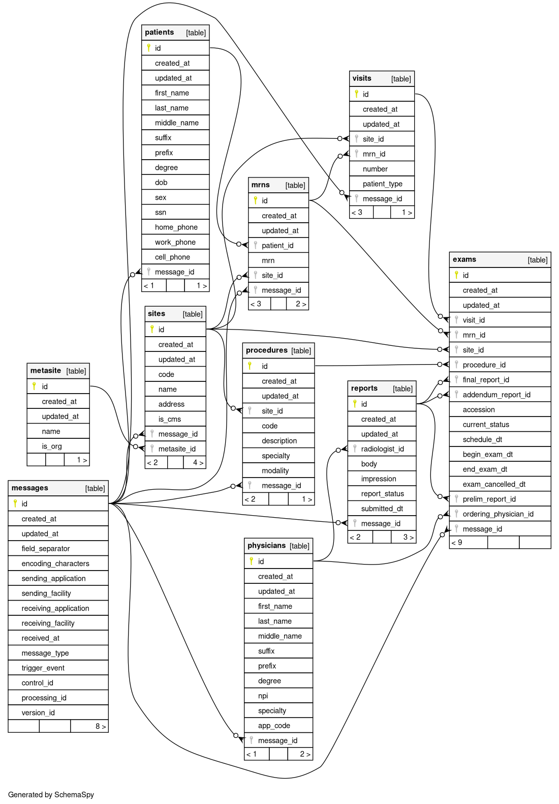

# Volta

[](https://github.com/s-hammon/volta/blob/master/LICENSE)
[](https://github.com/s-hammon/volta/actions/workflows/ci.yaml)
[](https://goreportcard.com/report/github.com/s-hammon/volta)

Volta is an HL7 message parsing service for use with the Google Healthcare API.

### Introduction

This project was designed primarily to work with the [Google Healthcare API service](https://cloud.google.com/healthcare-api/docs/), specifically with Health Level 7 (HL7) messages stored in HL7v2 data stores. This API works in conjunction with Google PubSub to publish notifications of newly received HL7 messages to Topics. Volta, then, may be deployed on Cloud Run and listen for reqeusts from a [Push subscription](https://cloud.google.com/pubsub/docs/push) containing a notification with the following structure:

```
{
    "message": {
        "data": *base64 encoded resource path*,
        "Attributes": {"Type": *ORM, ORU, etc*}
    },
    "subscription": "topic-subscription"
}
```

The value provided in `message.data` is an encoded resource path for an HL7 message stored in an [HL7v2 Store](https://cloud.google.com/healthcare-api/docs/how-tos/hl7v2) within the Google Healthcare API. Volta can take this file path and fetch the HL7 message from storage, upon which it will parse for objects to write to PostgreSQL.

As stated, this project was developed with the aforementioned Google services provided. This is handled by way of the `HealthcareClient` interface. Similarly, the `Repository` interface handles writing HL7 messages to storage:

```go
type HealthcareClient interface {
    GetHL7V2Message(string) (hl7.Message, error)
}

type Repository interface {
    UpsertORM(context.Context, models.ORM) error
    InsertORU(context.Context, models.ORU) error
}
```

### Models

Currently, the following HL7 messages and business objects are supported:

- ORM
    * message header info
    * sites
    * patients
    * MRNs
    * procedures
    * visits
    * physicians
    * orders
    * exams
- ORU
    * message header info
    * sites
    * patients
    * MRNs
    * procedures
    * visits
    * physicians
    * orders
    * exams
    * reports

**Database Schema**




### **Requirements**

- [gcloud](https://cloud.google.com/sdk/docs/install) CLI tool

# Install

- WIP

# Usage

<details>
<summary>Click to show <code>volta help</code> output</summary>

```
Usage:
  volta [command]

Available Commands:
  completion  Generate the autocompletion script for the specified shell
  help        Help about any command
  serve       Start the Volta service

Flags:
  -h, --help   help for volta

Use "volta [command] --help" for more information about a command.
```

</details>

## serve

Starts the parsing service.

    $ volta serve -d $DATABASE_URL
    $ {"level":"info","host":"localhost","port":"8080","message":"service configuration"}

You can specify the hostname/port with the `-H`/`-p` flags, respectively. Otherwise, Volta will use the default `localhost:8080`. You must provide the database URI with `-d`.

# Application Default Credentials

This project feches HL7 messages from the [Google Cloud Healthcare API](https://cloud.google.com/healthcare-api/docs), which requires setting up Application Default Credentials (ADC) in the development and production environments. This service does not use/issue API keys, for reasons I'm sure that are related to SOC2 standards. To learn/review how to set up ADC, please check out [Set up Application Default Credentials](https://cloud.google.com/docs/authentication/provide-credentials-adc).

